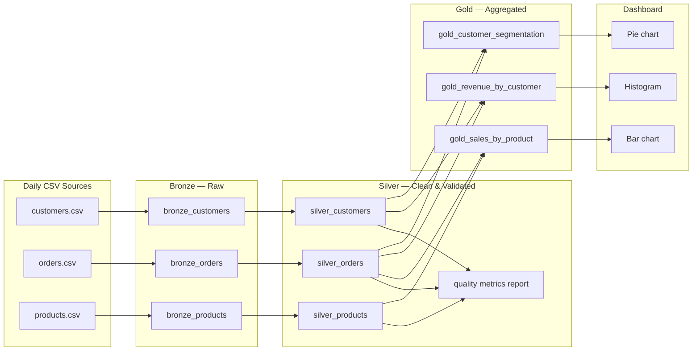

# Design Notes

Databricks Medallion Architecture pipeline for daily e-commerce sales data (~10K customers, ~100K orders, ~500 products).

---

## Architecture Overview

### End-to-end flow



**Text flow:**

```
customers.csv ──┐
orders.csv    ──┼──► Bronze (raw Delta + ingestion metadata)
products.csv  ──┘           │
                            ▼
                    Silver (typed, validated, quality_check_result)
                            │
              ┌─────────────┼─────────────┐
              ▼             ▼             ▼
     gold_sales_by_product  gold_revenue_by_customer  gold_customer_segmentation
              │             │             │
              └─────────────┼─────────────┘
                            ▼
              Dashboard (Databricks SQL — bar, histogram, pie)
```

### Why Medallion Architecture?

| Benefit | How it applies to this project |
|---------|--------------------------------|
| **Incremental processing** | Each layer can be re-run independently. If Gold SQL changes, we rebuild Gold from Silver without re-reading CSVs. If a DQ rule changes, we reprocess Silver from Bronze only. |
| **Data quality isolation** | Quality rules live exclusively in Silver. Bronze stays a faithful archive of what arrived; Gold never has to guess whether a row was validated. Failures are flagged in `quality_check_result`, not silently dropped. |
| **Clear ownership** | Ingestion engineers own Bronze; data quality owns Silver; analytics owns Gold and Dashboard. |
| **Auditability** | Delta Lake time travel on each layer supports “what did we know on date X?” investigations. |
| **Safe promotion** | Analysts and dashboards consume Gold only—never raw CSV quirks or half-cleaned Silver failures. |

### Layer summary

| Layer | Tables | Input | Output |
|-------|--------|-------|--------|
| Bronze | `bronze_customers`, `bronze_orders`, `bronze_products` | CSV on S3/DBFS | Raw Delta + ingestion metadata |
| Silver | `silver_customers`, `silver_orders`, `silver_products` | Bronze | Typed data + `quality_check_result` + metrics report |
| Gold | `gold_sales_by_product`, `gold_revenue_by_customer`, `gold_customer_segmentation` | Silver (PASS only) | Business aggregations |
| Dashboard | SQL queries | Gold | Visualizations in Databricks SQL Dashboard |

---

## Data Model

### Entity-relationship diagram

```
┌─────────────────────┐         ┌─────────────────────┐
│     customers       │         │      products       │
├─────────────────────┤         ├─────────────────────┤
│ customer_id (PK)    │         │ product_id (PK)     │
│ customer_name       │         │ product_name        │
│ email               │         │ category            │
│ country             │         │ price               │
│ signup_date         │         │ cost                │
│ customer_segment    │         │ stock_quantity      │
│ lifetime_value      │         │ reorder_level       │
└──────────┬──────────┘         └──────────┬──────────┘
           │                               │
           │ 1                          1  │
           │                               │
           └───────────┐       ┌───────────┘
                       │   *   │
                 ┌─────▼───────▼─────┐
                 │      orders       │
                 ├───────────────────┤
                 │ order_id (PK)     │
                 │ customer_id (FK)  │──► customers.customer_id
                 │ order_date        │
                 │ product_id (FK)   │──► products.product_id
                 │ quantity          │
                 │ unit_price        │
                 │ total_amount      │
                 │ order_status      │
                 │ payment_date      │
                 └───────────────────┘
```

### customers

| Column | Type | Constraints | Description |
|--------|------|-------------|-------------|
| `customer_id` | string / int | **PK**, not null | Unique customer identifier |
| `customer_name` | string | not null | Full name |
| `email` | string | not null | Contact email |
| `country` | string | not null | Country code or name |
| `signup_date` | date | not null | Account creation date |
| `customer_segment` | string | nullable | Marketing segment from source (may be enriched in Gold) |
| `lifetime_value` | decimal | nullable | Precomputed LTV from source (Gold may recalculate from orders) |

**Volume:** ~10,000 rows per daily load.

### orders

| Column | Type | Constraints | Description |
|--------|------|-------------|-------------|
| `order_id` | string / int | **PK**, not null | Unique order identifier |
| `customer_id` | string / int | **FK** → customers, not null | Ordering customer |
| `order_date` | date / timestamp | not null | When order was placed |
| `product_id` | string / int | **FK** → products, not null | Product ordered |
| `quantity` | int | not null, > 0 | Units ordered |
| `unit_price` | decimal | not null, ≥ 0 | Price per unit at time of order |
| `total_amount` | decimal | not null, ≥ 0 | Line total (quantity × unit_price expected) |
| `order_status` | string | not null | e.g. completed, pending, cancelled, refunded |
| `payment_date` | date | nullable | When payment cleared (null if unpaid) |

**Volume:** ~100,000 rows per daily load.

### products

| Column | Type | Constraints | Description |
|--------|------|-------------|-------------|
| `product_id` | string / int | **PK**, not null | Unique product identifier |
| `product_name` | string | not null | Display name |
| `category` | string | not null | Product category |
| `price` | decimal | not null, ≥ 0 | Current list price |
| `cost` | decimal | nullable, ≥ 0 | Unit cost (for margin analysis) |
| `stock_quantity` | int | nullable, ≥ 0 | Units in stock |
| `reorder_level` | int | nullable, ≥ 0 | Minimum stock before reorder |

**Volume:** ~500 rows per daily load.

### Layer table mapping

| Entity | Bronze | Silver | Gold consumers |
|--------|--------|--------|----------------|
| Customers | `bronze_customers` | `silver_customers` | `gold_revenue_by_customer`, `gold_customer_segmentation` |
| Orders | `bronze_orders` | `silver_orders` | All three Gold tables |
| Products | `bronze_products` | `silver_products` | `gold_sales_by_product` |

---

## Bronze Layer Design

**Location:** `src/bronze/`  
**Principle:** Land data exactly as received. No business logic.

### Ingestion approach

1. Read CSV from S3 or DBFS path (configurable per entity).
2. Use **`inferSchema=True`** and `header=True` so Spark infers column types from the daily file.
3. Write to Delta Lake with **`mode("overwrite")`** for daily full refresh (document if append strategy is adopted later).
4. Ingest **customers → products → orders** so parent entities exist before child FK validation in Silver.

### Delta tables

| Table | Source file |
|-------|-------------|
| `bronze_customers` | `customers.csv` |
| `bronze_orders` | `orders.csv` |
| `bronze_products` | `products.csv` |

### Ingestion metadata columns

Appended to every Bronze row—**not** present in source CSV:

| Column | Type | Description |
|--------|------|-------------|
| `ingestion_timestamp` | timestamp | When the file was ingested (cluster time) |
| `source_file` | string | Full path to source CSV |
| `row_count` | long | Total rows in the source file for that ingestion batch (same value on every row in the batch, enables batch-level audit) |

### What Bronze does not do

- No column renames (`customer_name` stays as-is)
- No type casting beyond Spark CSV inference
- No deduplication, joins, or filters
- No `quality_check_result` column
- No aggregations

### Scripts

| Script | Responsibility |
|--------|----------------|
| `01_ingest_customers.py` | Land `customers.csv` → `bronze_customers` |
| `02_ingest_orders.py` | Land `orders.csv` → `bronze_orders` |
| `03_ingest_products.py` | Land `products.csv` → `bronze_products` |
| `ingest_all.py` | Orchestrate all three; log total elapsed time |

### Error handling

- `try/except` around read and write with logging
- Log source row count after read, destination row count after write
- Fail fast on missing file or unreadable path

---

## Silver Layer Design

**Location:** `src/silver/`  
**Principle:** Cleanse, validate, and flag—**never delete** failed rows.

### Processing flow

```
bronze_*  →  cast types / trim strings  →  run DQ checks  →  silver_*  +  quality metrics report
```

### Quality checks (four dimensions)

Each check is a separate script; results merge into `quality_check_result`.

| Check | Script | Rules (summary) |
|-------|--------|-----------------|
| **Completeness** | `01_quality_completeness.py` | Required columns non-null (see table below) |
| **Uniqueness** | `02_quality_uniqueness.py` | PK unique per entity; flag all duplicate PK rows |
| **Type validation** | `03_quality_type_validation.py` | Dates parseable; numerics valid; email format for `email` |
| **Referential integrity** | `04_quality_referential_integrity.py` | Order FKs exist in Silver/Bronze customer and product sets |

**Required fields for completeness:**

| Table | Required columns |
|-------|------------------|
| `silver_customers` | `customer_id`, `customer_name`, `email`, `country`, `signup_date` |
| `silver_orders` | `order_id`, `customer_id`, `product_id`, `order_date`, `quantity`, `unit_price`, `total_amount`, `order_status` |
| `silver_products` | `product_id`, `product_name`, `category`, `price` |

### `quality_check_result` column

Every Silver row gets a result string:

| Value | Meaning |
|-------|---------|
| `PASS` | All checks passed |
| `FAIL_COMPLETENESS` | One or more required fields null |
| `FAIL_UNIQUENESS` | Duplicate primary key |
| `FAIL_TYPE_VALIDATION` | Invalid type or format |
| `FAIL_REFERENTIAL_INTEGRITY` | FK target missing |
| `FAIL_MULTIPLE:...` | Combined failures (optional composite code) |

**Policy:** Rows are never dropped. Gold filters `WHERE quality_check_result = 'PASS'`.

### Quality metrics report

Generated at end of `create_silver_tables.py` (log file, Delta table, or notebook output):

| Metric | Example |
|--------|---------|
| Table name | `silver_orders` |
| Total rows | 100,000 |
| Pass count | 98,500 |
| Fail count | 1,500 |
| Pass rate % | 98.5 |
| Failures by reason | `FAIL_REFERENTIAL_INTEGRITY`: 800, `FAIL_TYPE_VALIDATION`: 700 |

Suggested output table: `silver_quality_metrics` with columns `run_date`, `table_name`, `check_name`, `pass_count`, `fail_count`, `pass_rate`.

### Silver Delta tables

| Table | Source |
|-------|--------|
| `silver_customers` | `bronze_customers` |
| `silver_orders` | `bronze_orders` |
| `silver_products` | `bronze_products` |

### Orchestration

`create_silver_tables.py` runs: type standardization → checks 01–04 → write Silver tables → emit quality metrics report.

---

## Gold Layer Design

**Location:** `src/gold/`  
**Principle:** Business logic on trusted data only. **Silver PASS rows only.** Never read Bronze.

### Shared rules

- All SQL uses **CTEs** with clear aliases
- Join keys: `customer_id`, `product_id`, `order_id`
- Filter: `quality_check_result = 'PASS'` on every Silver source
- Materialize as Delta tables via `CREATE OR REPLACE TABLE`

### Table 1: `gold_sales_by_product`

**File:** `01_sales_by_product.sql`  
**Business question:** Which products drive volume and revenue?

| Output column | Logic |
|---------------|-------|
| `product_id`, `product_name`, `category` | From PASS `silver_products` |
| `total_quantity_sold` | `SUM(quantity)` from PASS `silver_orders` |
| `total_revenue` | `SUM(total_amount)` from PASS orders |
| `order_line_count` | `COUNT(*)` of order lines |
| `avg_unit_price` | `AVG(unit_price)` |

Join PASS orders to PASS products on `product_id`. Group by product.

### Table 2: `gold_revenue_by_customer`

**File:** `02_revenue_by_customer.sql`  
**Business question:** Who are our highest-value customers?

| Output column | Logic |
|---------------|-------|
| `customer_id`, `customer_name`, `country` | From PASS `silver_customers` |
| `total_orders` | `COUNT(DISTINCT order_id)` |
| `total_revenue` | `SUM(total_amount)` |
| `avg_order_value` | `total_revenue / total_orders` |
| `first_order_date`, `last_order_date` | `MIN` / `MAX` of `order_date` |

Join PASS orders to PASS customers on `customer_id`. Group by customer.

### Table 3: `gold_customer_segmentation`

**File:** `04_customer_segmentation.sql`  
**Business question:** How should we segment customers for marketing?

**Business logic (computed from orders, not source `customer_segment` alone):**

| Segment | Rule |
|---------|------|
| `high_value` | `total_revenue >= 5000` |
| `medium_value` | `total_revenue >= 500` and `< 5000` |
| `low_value` | `total_revenue > 0` and `< 500` |
| `no_purchase` | Customers with zero PASS orders (optional include from `silver_customers`) |

| Output column | Logic |
|---------------|-------|
| `customer_id`, `customer_name`, `country` | From PASS customers |
| `total_revenue` | Sum of PASS order amounts |
| `total_orders` | Order count |
| `revenue_segment` | Tier from table above |
| `source_customer_segment` | Original `customer_segment` from Silver for comparison |

### Orchestration

`create_gold_tables.py` executes SQL files in order and logs row count per Gold table.

---

## Dashboard Design

**Location:** `src/dashboard/dashboard_queries.sql`, `DASHBOARD_GUIDE.md`  
**Platform:** Databricks SQL Dashboard (Community Edition compatible)

### Visualization 1: Bar chart — Top products by revenue

**Source:** `gold_sales_by_product`  
**Chart type:** Bar  
**X-axis:** `product_name` (top 10)  
**Y-axis:** `total_revenue`  
**Use case:** Product performance, category planning

```sql
-- Top 10 products by revenue (bar chart)
SELECT
  product_name,
  category,
  total_revenue,
  total_quantity_sold
FROM gold_sales_by_product
ORDER BY total_revenue DESC
LIMIT 10;
```

### Visualization 2: Histogram — Customer order value distribution

**Source:** `gold_revenue_by_customer`  
**Chart type:** Histogram (bucket `avg_order_value` or `total_revenue`)  
**X-axis:** Revenue or AOV buckets  
**Y-axis:** Customer count  
**Use case:** Understand spending spread; identify bulk buyers vs one-time shoppers

```sql
-- Customer revenue distribution (histogram)
SELECT
  CASE
    WHEN total_revenue < 100 THEN '0-99'
    WHEN total_revenue < 500 THEN '100-499'
    WHEN total_revenue < 1000 THEN '500-999'
    WHEN total_revenue < 5000 THEN '1000-4999'
    ELSE '5000+'
  END AS revenue_bucket,
  COUNT(*) AS customer_count
FROM gold_revenue_by_customer
GROUP BY 1
ORDER BY MIN(total_revenue);
```

### Visualization 3: Pie chart — Customer segmentation mix

**Source:** `gold_customer_segmentation`  
**Chart type:** Pie  
**Slice:** `revenue_segment`  
**Value:** `COUNT(customer_id)`  
**Use case:** Marketing campaign targeting by segment size

```sql
-- Customer segment distribution (pie chart)
SELECT
  revenue_segment,
  COUNT(*) AS customer_count,
  ROUND(100.0 * COUNT(*) / SUM(COUNT(*)) OVER (), 1) AS pct_of_customers
FROM gold_customer_segmentation
GROUP BY revenue_segment
ORDER BY customer_count DESC;
```

### Optional fourth query

Top customers bar chart from `gold_revenue_by_customer` (`ORDER BY total_revenue DESC LIMIT 15`).

### Dashboard setup notes

1. Create a Databricks SQL dashboard and add three visualizations above.
2. Map query columns to chart encodings (Databricks SQL auto-suggests bar/pie/histogram).
3. Refresh on daily pipeline completion (manual or scheduled query refresh).
4. Document connection details in `DASHBOARD_GUIDE.md`—no credentials in repo.

---

## Technology Choices

| Choice | Rationale |
|--------|-----------|
| **Delta Lake** | ACID writes, schema evolution, time travel for audit |
| **PySpark** | Handles 100K+ orders; Community Edition compatible |
| **Modular scripts** | One file per ingest source and DQ dimension—easy to test and rerun |
| **SQL for Gold** | Transparent business logic for analysts; CTE-friendly |
| **Batch daily load** | Matches CSV drop pattern; no streaming complexity |

## Design Decisions Log

| Decision | Alternatives considered | Why we chose this |
|----------|-------------------------|-------------------|
| Medallion layers | Single-stage ETL | Isolation, incremental reruns, clear DQ boundary |
| Flag vs delete bad rows | Quarantine-only table | Keep full row count = Bronze; audit failures in place |
| Schema inference in Bronze | Explicit schema in Bronze | Faster landing; Silver enforces strict types |
| Three Gold tables | One wide denormalized table | Separated business questions; simpler dashboard queries |
| Computed segmentation in Gold | Trust source `customer_segment` | Revenue-based tiers reflect actual order behavior |

---

## Related Documents

| Document | Purpose |
|----------|---------|
| `requirements-analysis.md` | Functional requirements and acceptance criteria |
| `data-model.md` | Schema reference (keep in sync with this doc) |
| `data-quality-strategy.md` | Detailed DQ rules and thresholds |
| `.cursorrules` | Code standards for implementation |
